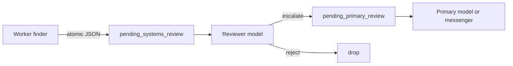

# Agent Review Envelope

**If you only open one file, open [`START_HERE.md`](START_HERE.md).**


Agent Review Envelope is a tiny Python library that makes
background **workers file a schema-locked JSON envelope** instead of messaging
humans, so a *different* process can fix, reject, or escalate before anyone
is paged.

* If the same agent that *found* a problem is allowed to
*word* the Slack/Signal/email, prompt injection and personality bleed become
“ops alerts.” This kernel restores **generator ≠ evaluator** with an atomic
filesystem outbox you can run on a laptop in ten minutes.

Suggested GitHub / PyPI name: **`agent-review-envelope`**

## Who it helps

| Who | What they get |
| --- | --- |
| **You (the technician)** | A drop-in `enqueue_systems_review()` that `fsync`s JSON. No Redis required. |
| **AI agents / harnesses** | Read-only MCP tools to *inspect* the outbox — not a `send_chat` tool. |
| **People talking to those agents** | Alerts that survived a judge, not whatever the finder model felt like saying. |

## Who should skip this

Single-chat bots with no workers. Teams that already have a human ticket
queue and never let models page.

## How it connects to AI agents



| Style | When |
| ----- | ---- |
| **File worker** (recommended) | Your daemon calls `build_review_payload` + `enqueue_systems_review`. |
| **MCP (read-only)** | Cursor / Claude Desktop lists and reads pending JSON. Must **not** enqueue. |
| **Both** | Workers write; humans and chat models inspect. |

## 10-minute first success

```bash
chmod +x scripts/smoke.sh
./scripts/smoke.sh
# optional: named demo dir
export AGENT_HOME=/tmp/agent-review-envelope-demo
python3 -m pip install -e .
python3 examples/quickstart.py
ls "$AGENT_HOME/outbox/pending_systems_review"
```

Success is a `.json` file on disk whose `schema` is `cynical_review_envelope`
and whose `orchestrator.workflow` is exactly
`review_validate_act_then_escalate`. A typo **quarantines** the item. That is
the product.

## Hardware / software

| Resource | Minimum |
| -------- | ------- |
| OS | Linux, macOS, or Windows with Python **3.10+** |
| RAM | Trivial (kilobytes per envelope) |
| GPU | **None** |
| Network | **None** for the library itself |

Optional: `mcp` extra to run `examples/mcp_server.py` on the **agent host**.

## Repository layout

| File | What it does | What you change it for |
| ---- | ------------ | ---------------------- |
| `START_HERE.md` | First-use, 10 minutes | You usually do not |
| `README.md` | Product + value prop | Forks / rename |
| `docs/hero.png` | Banner | Branding |
| `docs/MCP.md` | How MCP wraps the outbox | New MCP tools |
| `docs/INTEGRATION.md` | MCP + local-agent wiring | New host |
| `docs/ADVANCED.md` | Real-world patterns (evergreen) | Architecture debates |
| `review_queue.py` | Builder, validator, atomic enqueue | Schema (rarely) |
| `paths.py` | `AGENT_HOME` stub | Demo dirs only |
| `examples/quickstart.py` | First JSON drop | Learning |
| `examples/mcp_server.py` | Read-only MCP | Tool names |
| `examples/mcp.example.json` | Host config template | Absolute paths |
| `tests/` | Contract tests | Behavior changes |
| `scripts/smoke.sh` | unittest + quickstart | CI locally |

## Fail-closed contract

These strings must stay exact or a poller should refuse the file:

- `schema` = `cynical_review_envelope`
- `schema_version` = `1.0`
- `orchestrator.workflow` = `review_validate_act_then_escalate`
- `orchestrator.autonomous_action_expected` = `true`
- `orchestrator.escalate_when` = `unresolved_or_approval_required`

`allow_code_blocks` is **admin-only**. Fenced code in a user-bound message is
an injection surface, not formatting.

## Related kernels

| Kernel | Why |
| ------ | --- |
| `epistemic-deny` | Tool denies the model cannot narrate as success |
| `casualty-aware-watchdog` | Escalate through *this* envelope, not a raw DM |
| `whitehat-secret-policy` | Enqueue review only when `valid_keys_found > 0` |
| [Curiosity-Docker](https://github.com/CynicalTyr/Curiosity-Docker) | Username sidecar; its *findings* should also file envelopes, not chat |

## What others will discover (that demos hide)

These dynamics show up **after** someone else runs this in a real loop.
Ordinary READMEs skip them; they are why the kernel exists.

| Lens | In this kernel |
| ---- | -------------- |
| **Recurring pattern** | Generator ≠ evaluator. The process that *finds* a problem must not *word* the human message. |
| **Feedback loop** | Worker JSON → systems verdict → primary or drop. If the reviewer is also used as an extractor, you get chat, then a cooldown on nothing. |
| **Hidden incentive** | Direct chat is the shortest path to “the human saw it.” Every worker will try to skip the envelope unless skip is more expensive than filing. |
| **Leverage point** | Keep orchestrator.workflow exact. A typo quarantines the item. That rigidity is the product. |
| **Asymmetry** | Admin may receive fenced code; users must not. Fences are an injection surface, not formatting. |
| **Cause → effect** | Same model finds and pages → prompt injection becomes an ops alert. Envelope + second process → replayable, rejectable speech. |
| **Opportunity** | This is the kernel most agent builders are missing. Search: agent Slack without review. |
| **Risk if copied blindly** | People will add a send-chat MCP tool “just for debugging.” That collapses dual-control. |

**Hidden principle:** dual-control is a *process* split plus a *schema* lock, not a prompt that says “please don’t Slack.” A competent engineer still violates this by putting `interrupt()` in the same graph that will send after resume.

**Mental model:** adopters think “human-in-the-loop” means pause-the-agent. This kernel assumes **finder ≠ evaluator ≠ messenger**. LangGraph `interrupt()` (see `libs/prebuilt/langgraph/prebuilt/interrupt.py`) pauses the *same* graph for `Command(resume=...)`. A transactional `outbox.py` reliably emits DB events. Neither stops the finder from wording the page.

**Second-order:** once teams copy this, they will measure “time to Slack” and add an enqueue MCP tool to “speed the demo.” That metric is the bypass. Count envelopes that reached reject/primary vs pages from any other process.

Deeper case studies: [`docs/ADVANCED.md`](docs/ADVANCED.md). Wiring: [`docs/INTEGRATION.md`](docs/INTEGRATION.md).


## License

MIT. See `LICENSE`.
