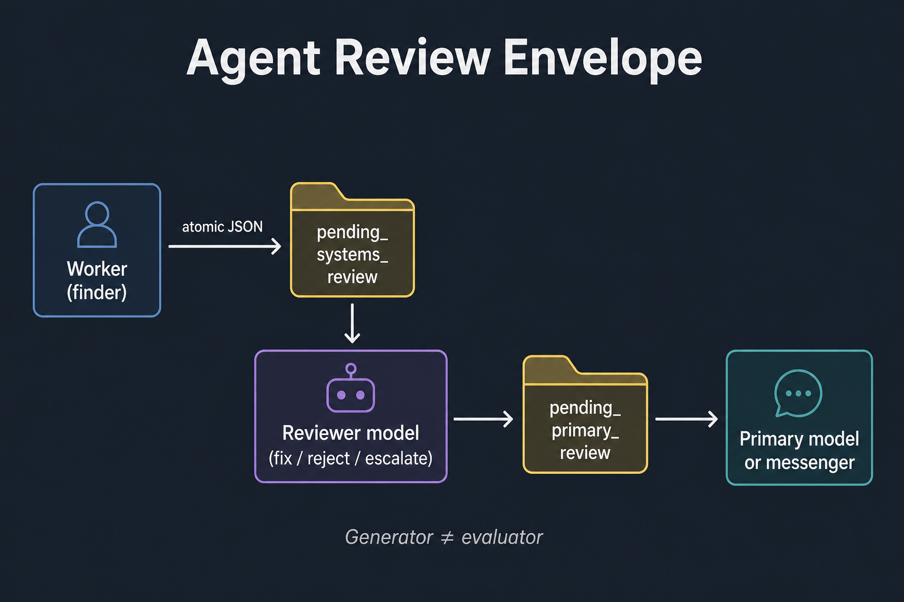

# START HERE

**If you only open one file, open this one.**

This guide assumes you can log into a computer, open a terminal, and paste
commands. It does **not** assume you know Docker, MCP, or how AI agents work.



Background workers write a locked JSON file instead of
messaging a human, so a *different* program can reject or approve the wording
before anyone is paged.

## Who this helps

| Who | What they get |
| --- | --- |
| **You (learning)** | A 10-minute proof the code runs (`smoke ok`) and a JSON file on disk. |
| **An AI harness** | Cursor, Claude Desktop, Copilot Chat — a program that runs a model *and* tools. See §5. |
| **A locally built AI** | Your own Python/timer worker. Function calls. MCP is optional. See §6. |
| **People talking to that AI** | Alerts that survived a judge, not whatever the finder model felt like saying. |

---

## 0. Words you will see, then files

| Word | Plain meaning |
| ---- | ------------- |
| **Harness** | The IDE or app that hosts the model (Cursor, Claude Desktop). It can start **MCP tools**. |
| **MCP** | A way for the model to call small tools. Tools are not automatically safe. |
| **Locally built AI** | Your own loop: your code calls models and functions. You decide the order. |
| **Kernel** | This tiny library. It is not a full chatbot. |
| **Envelope** | One JSON file that is the *only* legal way to ask for a human page. |

| File | What it does | What you change it for | How it helps agents / users |
| ---- | ------------ | ---------------------- | --------------------------- |
| `START_HERE.md` | This first-use guide | You usually do not | Humans: how to get `smoke ok` |
| `README.md` | Product + hidden dynamics | Forks / rename | Humans: “is this the right tool?” |
| `docs/hero.png` | Banner | Branding | Humans: 10-second mental model |
| `docs/INTEGRATION.md` | Worker + MCP recipes | New host | Custom AI *and* harness |
| `docs/ADVANCED.md` | Why two queues (search article) | Architecture debates | People who already had the Slack incident |
| `docs/MCP.md` | Read-only inspect tools | New MCP tool names | Harness agents — **no send-chat** |
| `review_queue.py` | Build, validate, atomic enqueue | Schema (rarely) | The worker’s only write path |
| `paths.py` | `AGENT_HOME` directories | Demo dirs only | Where JSON lands |
| `examples/quickstart.py` | First JSON drop | Learning | Proof without a real messenger |
| `examples/mcp_server.py` | MCP child process | Tool names | Harness *inspects* the outbox |
| `examples/mcp.example.json` | Host config template | Absolute paths | Paste into Cursor / Claude Desktop |
| `tests/` | Contract tests | Behavior changes | Schema stays fail-closed |
| `scripts/smoke.sh` | unittest + quickstart | CI locally | 10-minute first success |
| `.env.example` | Env **names** | Copy to `.env` (never commit `.env`) | `AGENT_HOME` for demos |

**Mental picture (same as the banner):**

```
Worker (finder)  →  JSON envelope on disk  →  reviewer process  →  messenger
Harness (optional)  →  MCP read-only tools  →  same JSON files (inspect only)
```

---

## 1. What you need

- Python 3.10 or newer. Check: `python3 -V`
- Ability to `cd` into this folder (the clone root)
- A throwaway directory for `AGENT_HOME` (use `/tmp/...`, never a real home)

No GPU. No Docker. No API keys for the 10-minute path.

---

## 2. First success (under 10 minutes)

From **this folder** (after clone it is named `agent-review-envelope`):

```bash
chmod +x scripts/smoke.sh
./scripts/smoke.sh
```

You want a line `smoke ok:` and no traceback. That script sets `PYTHONPATH`
and a throwaway `AGENT_HOME` under `/tmp`. Optional later:

```bash
python3 -m pip install -e .
cp .env.example .env
# edit AGENT_HOME in .env if you want a stable demo dir
export AGENT_HOME=/tmp/agent-review-envelope-demo
python3 examples/quickstart.py
ls "$AGENT_HOME/outbox/pending_systems_review"
```

**This kernel’s success looks like:** a `.json` file whose `schema` is
`cynical_review_envelope` and whose `orchestrator.workflow` is exactly
`review_validate_act_then_escalate`.

If `python3` is missing, install Python from python.org or your package
manager, then try again.

---

## 3. How to edit (safe)

Change Python files in *this* folder. Re-run `./scripts/smoke.sh`.

If you use MCP, **restart the harness** after editing
`examples/mcp_server.py` (the child process is already running). Do not
copy this folder over a live operator machine “to try it.”

---

## 4. Configure

Copy `.env.example` to `.env` if you want a named demo home. Fill **names
you own**. Never commit `.env`.

The only env this library needs is `AGENT_HOME` (where `outbox/` is created).
There is no production messenger token in this repo on purpose.

---

## 5. Using this with an AI harness (Cursor / Claude Desktop / MCP)

A **harness** is the program that runs the model and its tools. It does
**not** magically import this folder. You either:

1. Add an MCP server from `examples/mcp_server.py` (see `docs/MCP.md`) — **read-only**, or
2. Keep the kernel in **your daemon**. The chat model only *inspects* results.

The MCP Python SDK (`FastMCP`, `@mcp.tool()`, `mcp.run()`) keeps logs on
**stderr** so stdout stays a JSON-RPC pipe. Use an **absolute** path in the
host config. Restart the harness after edits.

Paste-ready policy:

> You may call review_envelope_health and review_envelope_read. Summarize
> kind and summary for the operator. Do not invent a verdict. Do not claim
> a messenger already fired. Do not ask for a send-chat or enqueue tool.
> Dual-control dies the first time you add one “just for debugging.”

---

## 6. Using this with a locally built AI (no MCP)

Your worker process calls `enqueue_systems_review`. A *different* timer
reads the folder and judges. The chat model is **not** that worker.

Copy `examples/quickstart.py` into your worker, then replace the demo
arguments with your IDs, tools, and paths. If enqueue raises, log to
stderr and skip — do **not** fall back to a DM.

Recipes: [`docs/INTEGRATION.md`](docs/INTEGRATION.md).

---

## 7. Practice drills (do these once)

1. `recipient_role=user` + `allow_code_blocks=True` must raise `ValueError`.
2. Typo `orchestrator.workflow` then `validate_review_payload` must raise.
3. Confirm `examples/mcp_server.py` has no send-chat / enqueue tool.
4. Re-run `./scripts/smoke.sh`. It must still pass.
5. Open `docs/ADVANCED.md` once (evergreen / search tutorial).

---

## 8. When something is wrong

| Symptom | Try |
| ------- | --- |
| `No module named ...` | Run `./scripts/smoke.sh` from *this* folder (it sets PYTHONPATH), or `pip install -e .` |
| `Permission denied` on smoke.sh | `chmod +x scripts/smoke.sh` |
| MCP tools missing | Absolute path to `examples/mcp_server.py`; restart the harness |
| MCP host “won’t connect” | No prints on stdout; SDK logs to stderr (see MCP Python SDK docs) |
| Model ignores the kernel | The result never reached the tool channel — see INTEGRATION |
| JSON landed but poller ignores it | Check exact `orchestrator.workflow` string — a typo quarantines |

---

## 9. What not to do

- Do not skip the kernel “just this once” (that is how dual-control dies).
- Do not commit secrets, phones, or live identity YAML.
- Do not add a send-chat MCP tool “for debugging.”
- Do not treat first success as production-ready without INTEGRATION.
- Do not let the finder process also be the messenger.

**Risk to remember:** People will add a send-chat MCP tool “just for debugging.”
That collapses dual-control.

---

## 10. Where to go next

| Need | Open |
| ---- | ---- |
| Why this exists / hidden dynamics | [`README.md`](README.md) |
| Recipes for harness + custom AI | [`docs/INTEGRATION.md`](docs/INTEGRATION.md) |
| Advanced / search tutorials | [`docs/ADVANCED.md`](docs/ADVANCED.md) |
| MCP inspect tools | [`docs/MCP.md`](docs/MCP.md) |

You are done with first use when smoke prints `ok` and you can say in one
sentence whether **your** agent is a harness, a custom loop, or both.
